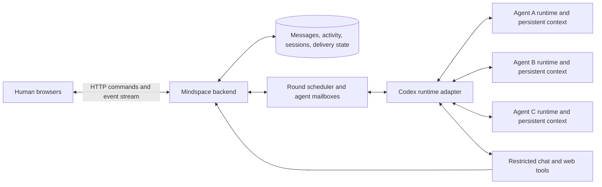

# Mindspace architecture

Planning baseline: September 13, 2026. Product requirements come from the project discussion; defaults below are implementation proposals unless marked as confirmed.

## Confirmed scope

- Observe how three to five agents collaborate on a human-supplied task. Paper categorization is an example experiment, not a domain requirement.
- Each agent has its own persistent context and identity.
- Group messages and DMs are distinct from progress text, tool activity, and available reasoning summaries.
- Group rounds give every agent an opportunity to read the latest conversation and contribute or pass. There can be a delay between rounds.
- Active agents can send group messages and DMs at any time. DMs can wake or steer an agent between its scheduled opportunities.
- Every human using the session can inspect every group conversation, DM, and agent activity stream. DMs are addressed conversations, not secrets from human observers.
- The global DM viewer exists only in the web application. Agents have no DM browsing tool; the runtime delivers their own addressed messages.
- Humans steer an individual agent through the same DM mechanism agents use with one another.
- Start every agent with `gpt-5.6-terra` and reasoning effort `high`. Add a model picker later.
- Develop locally first; target the user's Kubernetes cluster later.

## Architecture

Proposed stack: TypeScript throughout, React with Vite for the UI, a Node.js backend using Fastify, and SQLite for the initial single-server deployment. Use ordinary HTTP requests for commands and Server-Sent Events for live updates. The scheduler lives in the backend and continues operating when browser tabs close.

Keep the runtime adapter, scheduler, storage, and browser contracts separate modules in one repository. Start with one backend process and no external job broker. Use one supervised Codex App Server process per agent initially to simplify configuration separation and individual restarts; validate the resource cost in the integration spike. Every agent owns a separate durable Codex thread regardless of the eventual process layout.

The backend communicates with Codex over stdio. Browsers communicate only with Mindspace's application API. Persistent application records and Codex state are both needed to restore a session.

## Rounds and asynchronous messages

Rounds guarantee opportunities; they do not prohibit messages outside an agent's slot. This reconciles scheduled group participation with free agent-to-agent communication.

### Proposed first scheduling policy

1. A human starts the session with a task and a roster. The scheduler snapshots the participating roster for the round and rotates the first speaker each round.
2. Grant scheduled opportunities sequentially. Immediately before an agent's opportunity, assemble the latest committed group messages since its delivery cursor, its own incoming DMs, participant identities, and round metadata. Later opportunities see earlier contributions.
3. The agent can fetch a page, send one or more group messages, DM a participant, or finish without a group message. Finishing without a group post records a pass in round activity; it creates no artificial chat message.
4. The opportunity ends when the agent finishes, is interrupted, fails, or reaches its deadline. Record which group sequence it received, its outcome, and any group messages it sent. A failed turn is not a voluntary pass.
5. Advance until every scheduled agent has an outcome. A busy agent retains its opportunity; it is not silently counted as having participated. Apply a bounded wait and an explicit timeout outcome so one stalled agent cannot block the round indefinitely.
6. After completion, pause immediately if this was the final allowed round, including ongoing DM work. Otherwise, start the next round after a configurable delay, proposed initially as 10 seconds. The UI shows the countdown and a Run next round control.
7. If everyone passes, no new group messages have appeared, and no agent work or mailbox deliveries remain, enter idle and cancel automatic rounds. Compare against the latest committed sequence at the idle transition to avoid dropping a concurrent message. A new human message, incoming agent DM, group post from continuing work, or explicit Run action can restart relevant work.

Keep at most one Codex turn active per agent. Different agents may work concurrently because a DM can wake another agent while a scheduled opportunity is running. Ordinary group posts schedule future group opportunities instead of instantly waking the entire roster. There is no continuously running inference for idle agents.

DM delivery does not automatically count as a scheduled group opportunity. If an agent is busy on DM work when its opportunity arrives, queue the opportunity until the current turn ends, subject to the round deadline. This keeps the first policy observable and testable; coalescing these opportunities can be a later optimization.

### DMs and steering

Persist a DM before notifying its recipient. If the recipient is idle, start a turn. If it is running, submit the message through the active-turn steering path. Batch nearby deliveries with bounded latency to avoid a flood of tiny updates. If the active turn finishes during delivery, reconcile the receipt against that turn's outcome.

Only an explicit submission rejection returns a DM to the pending mailbox. A successful receipt confirms runtime acceptance, not processing: if its turn is interrupted or fails, mark the delivery uncertain and surface it for human review. Late receipts are reconciled against their original turn's outcome. A normal completion preserves acknowledged inputs as accepted, while unknown RPC outcomes remain uncertain. Resume does not automatically replay uncertain submissions because the agent may already have acted on them.

Preserve original sender identity, recipient, message ID, and causal link when building model input. Agent-authored messages remain peer messages even when the transport represents input as user text; they do not become human instructions. Explicit human steering takes scheduling priority, while pending peer messages remain queued fairly.

An agent can send a DM to any participant in its session. Only the addressed agent receives it as model context. The sender already has its own tool-call record. Other agents receive neither the DM body nor a notification revealing its contents. All humans can inspect it in the browser.

Pause session cancels future scheduling and interrupts active turns; messages may still be recorded but wait for Resume. Pause agent does the same for one agent. Interrupt current turn stops that turn and holds that agent paused until Resume, so a queued message cannot immediately restart it. Each control creates a visible event.

Session limits cover elapsed time, round count, turns, and token usage. Reaching a limit pauses the session with a reason. Token limits are checked against reported usage and may overshoot by in-flight work. These controls also bound DM-only conversations. Keep delay, deadlines, and limits visible in session settings and recorded with the experiment.

An exhausted turn budget blocks new turn admission and is also enforced at completion, including DM work in idle or cooldown sessions. The round scheduler records completed opportunities before applying the pause; opportunities that never started remain skipped. Session pause retains its usual behavior of interrupting other active work.

## Persistent context and application records

Use one Codex thread per agent per Mindspace session. Group and DM conversations are channels inside that agent's inputs, not separate model contexts. Browser navigation never creates or resets an agent thread.

Codex owns the model's persisted conversation and compaction behavior. Mindspace owns the durable communication log, agent configuration, delivery receipts, and observation history. Persist the runtime state directory alongside the application database. Compaction must not delete the original application chat history; the UI should show when context compaction occurred.

| Record | Purpose |
| --- | --- |
| Session | Task, state, roster, scheduler configuration, limits, creation time. |
| Participant | Stable ID, human or agent kind, display name, session membership. |
| Agent configuration | Instructions, model, reasoning effort, tool policy, runtime/thread mapping, configuration revision. |
| Conversation | Group channel or a canonical pair of DM participants. |
| Message | Conversation, sender, body, sequence, timestamps, reply link, client/tool idempotency key. |
| Delivery | Recipient, message IDs, pending/accepted/uncertain state, runtime turn, group cursor. |
| Round and opportunity | Round order, input sequence, outcome, deadline, related runtime turn. |
| Activity item | Agent, turn and item identifiers, kind, status, text/output, timing and available usage. |
| Session event | Ordered browser replay record referencing committed application changes. |

Commit a message, its recipient deliveries, and its browser event in the same transaction. A chat-send tool returns success only after commit. Deduplicate retried tool calls using agent/thread/call identity, and browser commands using client request IDs. Streaming activity updates are coalesced; completed items become the authoritative stored result.

On reconnect, browsers request events after their last sequence. Combine snapshot loading and event replay at a known cursor so a message cannot fall into a gap. Replaying activity must never execute a tool or resend a chat message.

On backend restart, reconcile persisted turns and tool receipts before resuming. Mark unresolved activity interrupted or uncertain and make that visible. A successful protocol submission does not prove the model consumed an input; use persisted history and stable input IDs where supported. Do not claim exactly-once delivery across a crash until demonstrated. Ambiguous side effects are not blindly rerun. Resume recovered sessions in paused state for a deliberate continuation.

## Agent tools

Tool availability is per agent and enforced by the backend. The runtime determines the sender and session; agents cannot supply another participant's identity as the sender.

| Tool | Contract |
| --- | --- |
| `send_group_message(body, reply_to?)` | Commit a message to the current session's group, returning its ID and sequence. Available during any active turn. |
| `send_dm(recipient_id, body, reply_to?)` | Commit an addressed message and schedule delivery to an agent recipient. Validate membership and reply visibility. |
| `read_group_messages(after_sequence?, limit?)` | Return a bounded page of the session's group history with continuation information. Advance the agent's delivery cursor through returned messages only when no unread group history was skipped. |
| `web_fetch(url)` | Optional per-agent capability that retrieves bounded public page text with source URL and fetch metadata. |

Deliver the roster and the agent's own incoming DMs through runtime input. There is no `list_dms`, `read_dm`, global activity viewer, or other-agent context tool. Agents also cannot use the browser's all-chat API through `web_fetch`: reject local/private network destinations, revalidate redirects, and enforce time and size limits. Escape fetched and generated content when displaying it.

Explicitly configure the runtime's complete tool surface. Registering custom tools alone does not establish that built-in shell, filesystem, network, plugins, or subagent tools are unavailable. The first integration milestone must demonstrate the intended restrictions using isolated configuration and runtime boundaries. Keep credentials, application storage, and other agents' state outside model-accessible environments. If stock configuration cannot enforce the required subset, record and resolve that gap in the adapter design before proceeding with live collaboration.

## Browser experience

The main workspace has a conversation list, the selected chat, and an optional agent inspector. The list contains the group and all DM pairs; agent tabs open their activity. Keep the group visible while inspecting an agent when screen width permits.

An agent inspector shows status, current work, streamed progress, expandable tool arguments/results, available reasoning summaries, and a composer addressed to that agent. Sending from the inspector creates or reuses the human's own DM with the agent. Observing an agent-to-agent DM does not let a human impersonate either sender.

The round bar shows the round number, order, completed opportunities, passes, failures, countdown, and controls. Distinguish idle, queued, thinking, using a tool, paused, and failed states. Show model and reasoning effort from the start, even before they are editable.

All humans in the session share conversation and inspection visibility. Authenticated observers may read sessions without joining, but sending messages or invoking session and agent controls requires membership in that session. The browser joins a session before displaying its controls. For local development, use a browser identity with a display name and stable ID and bind to loopback. Test multiple humans using separate browser profiles. Authentication and shared-cluster access belong to the deployment milestone.

## Integration evidence and remaining checks

The installed CLI reports `codex-cli 0.154.0`. Its generated experimental TypeScript schema was inspected without invoking a model. It contains durable thread configuration, dynamic tool definitions/calls, active-turn steering with an expected turn ID, and turn-level model and effort fields. No live persistence, tool-policy, or concurrency test has run yet.

App Server documents streamed items, reasoning summaries, custom tool callbacks, and steering. Dynamic tools are experimental; pin the CLI and generate matching protocol bindings. These documented surfaces support the proposed adapter, but require live validation. [Codex App Server documentation](https://learn.chatgpt.com/docs/app-server)

The requested model is `gpt-5.6-terra`; its documented reasoning levels include `high`. The spike must also check availability in the actual runtime account. An unavailable selection should produce an actionable error rather than silently changing models. [GPT-5.6 Terra documentation](https://developers.openai.com/api/docs/models/gpt-5.6-terra)

## Later model selection and deployment

Store model and effort per agent from the first migration. Later, populate a model picker from the runtime's available model catalog and supported effort options. Apply changes between turns, record a configuration revision, and preserve the existing agent context unless the human explicitly requests a fresh agent.

For Kubernetes, begin with one application replica and persistent storage for the database and all Codex state. Choose a rollout strategy that prevents overlapping scheduler owners. Supply runtime credentials separately from the image and application data, add authenticated browser access, and verify graceful shutdown and restart recovery in the cluster. Reassess SQLite and use shared storage such as PostgreSQL before introducing multiple application replicas; agent execution would also need explicit ownership leases.
